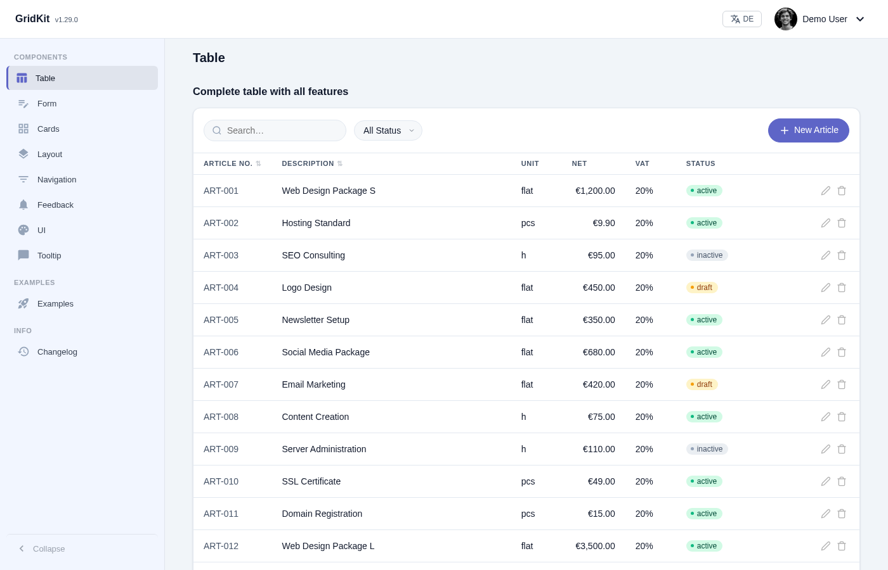
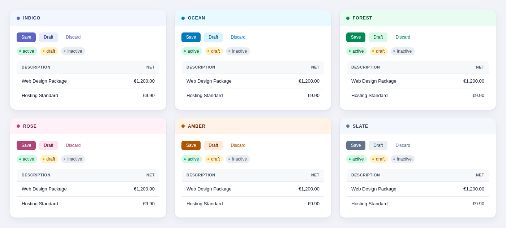
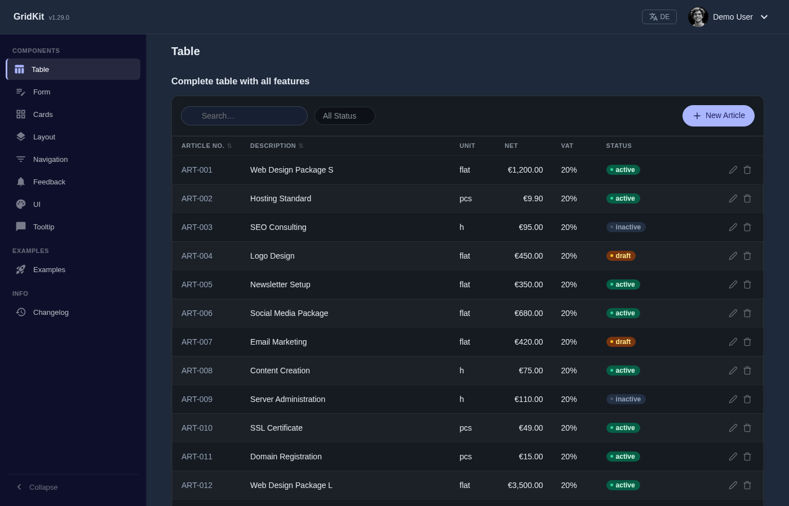
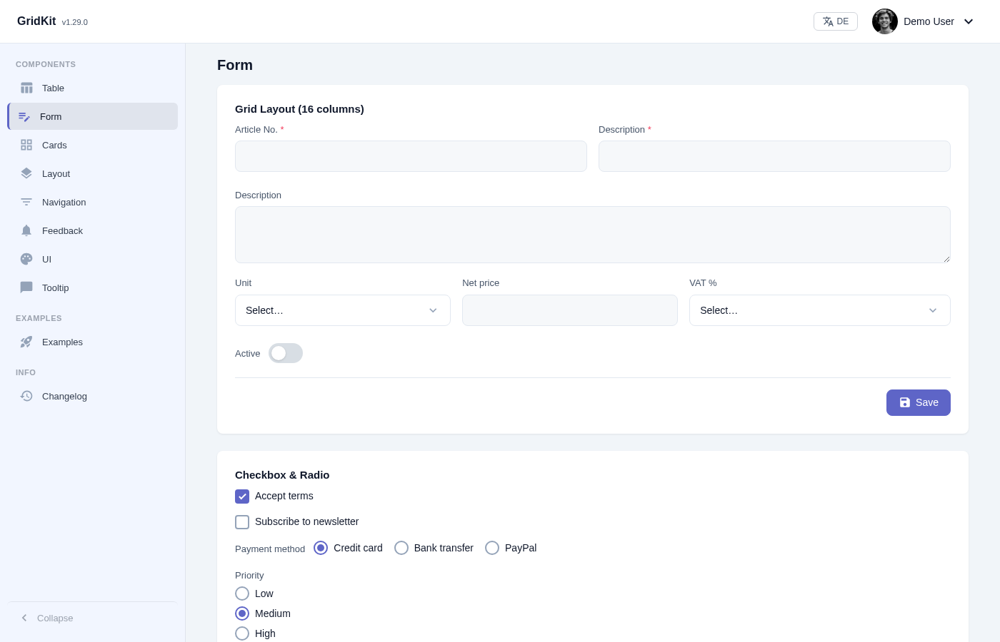

# GridKit

**PHP components for admin dashboards. No build step, no dependencies, no JavaScript framework.**

[](https://packagist.org/packages/mmollay/gridkit)
[](https://github.com/mmollay/gridkit/releases)
[](LICENSE)
[](https://php.net)

You write PHP. You get a searchable, sortable, filterable, paginated table that
reloads over AJAX — with themes, dark mode and a mobile layout you didn't have
to think about.



---

## The whole CRUD table

Not a snippet — this is the complete file.

```php
<?php
require_once '/path/to/gridkit/autoload.php';
use GridKit\Table;

(new Table('products'))
    ->query($db, "SELECT * FROM products ORDER BY name")
    ->search(['name', 'sku'])
    ->column('sku',       'SKU',     ['width' => '120px', 'muted' => true])
    ->column('name',      'Product', ['sortable' => true])
    ->column('price',     'Price',   ['format' => 'currency', 'sortable' => true])
    ->column('is_active', 'Status',  ['format' => 'label'])
    ->button('edit',   ['icon' => 'edit',   'modal' => 'edit_product'])
    ->button('delete', ['icon' => 'delete', 'confirm' => true])
    ->modal('edit_product', 'Edit', 'forms/product.php', ['size' => 'medium'])
    ->newButton('New product', ['modal' => 'edit_product'])
    ->paginate(25)
    ->render();
```

Search, sort, filter and paging run over AJAX. The edit button opens a modal
that loads `forms/product.php`. The delete button asks first, then fires
`gk:rowaction` with the row's id — your application decides what deleting
means. The empty state knows whether the table is genuinely empty or just
filtered, and offers a way back.

```js
table.addEventListener('gk:rowaction', e => {
    const { action, params } = e.detail;         // 'delete', { id: 42 }
});
```

---

## A whole application

The snippet above is a table. This is what it looks like around one:


[`examples/invoices/`](examples/invoices/) is a working invoice manager — list,
create, edit, delete, with search, filter, sort and paging answered by the
server over AJAX. English and German, its own strings loaded into GridKit's
catalogue with `Lang::loadDir()`. Around 700 lines across five files and a
`lang/` directory, no database, no build step.

```bash
git clone https://github.com/mmollay/gridkit.git
cd gridkit && php -S localhost:8000
```

Then open <http://localhost:8000/examples/invoices/>. [What each file does.](examples/README.md)

---

## Install

```bash
composer require mmollay/gridkit
```

Composer puts GridKit under `vendor/mmollay/gridkit/`, and its `css/` and `js/`
go with it. `Layout::asset()` stamps the path you hand it — it does not resolve
one — so hand it a path the browser can reach:

```php
<link rel="stylesheet" href="<?= Layout::asset('vendor/mmollay/gridkit/css/gridkit.css') ?>">
<link rel="stylesheet" href="<?= Layout::asset('vendor/mmollay/gridkit/css/themes.css') ?>">
<script src="<?= Layout::asset('vendor/mmollay/gridkit/js/gridkit.js') ?>"></script>
```

If `vendor/` sits outside your document root, copy or symlink
`vendor/mmollay/gridkit/{css,js}` into the public root and drop the prefix.

Or clone it — GridKit has no build step, so a checkout is a working install:

```bash
git clone https://github.com/mmollay/gridkit.git
mkdir -p my-app && cp gridkit/skeleton.php my-app/index.php
php -S localhost:8000
```

Then open <http://localhost:8000/my-app/>. `skeleton.php` is a working page:
sidebar, fixed header, theme switcher, content area, a table with a modal form,
assets wired up. It looks for GridKit beside itself, one directory up, and in
`vendor/` — so the copy above works without editing anything. If you put it
somewhere none of those reach, it says so and tells you which line to change.

**Requirements:** PHP 8.2+ and a browser with CSS Custom Properties.
No npm, no Composer plugins, no compilation. `mbstring` is used when present
but not required.

**One thing the Composer package leaves out:** the bundled CKEditor 5 build that
backs the rich-text form field. At 1.7 MB it would otherwise dominate every
install of a framework that advertises zero dependencies. A git clone includes it under
`assets/ckeditor5/` and the demo uses it; if you need the rich-text field from a Composer
install, include CKEditor yourself. Every other component works out of the box.

---

## Six themes, light and dark

A theme is one hue. Colours are derived in OKLCH from that single value, so
every theme keeps the same lightness and the same contrast — white on the
primary surface measures between 4.69:1 and 5.73:1 across all six, so every
one of them clears WCAG AA rather than most of them.



```css
[data-gk-theme="mint"] { --gk-theme-hue: 175; }
```

That is a complete seventh theme. Switching happens on `<body>`:

```html
<body class="gk-root" data-gk-theme="ocean" data-gk-mode="dark">
```



---

## Forms

Sixteen-column grid, validation, file upload with drag & drop, searchable
selects, rich text. Same fluent API as everything else.



```php
(new Form('product'))
    ->field('sku',   'SKU',     'text',     ['required' => true, 'width' => 4])
    ->field('name',  'Product', 'text',     ['required' => true, 'width' => 12])
    ->field('notes', 'Notes',   'textarea', ['width' => 16])
    ->field('unit',  'Unit',    'select',   ['options' => $units, 'width' => 6])
    ->render();
```

---

## Built for AI agents

This is the part that makes GridKit different from other component libraries.

[`GRIDKIT_SKILL.md`](GRIDKIT_SKILL.md) is a single structured document that
teaches any assistant — Claude, GPT, Gemini — the complete API: every
component, every option, code patterns, common recipes. Drop it into your
agent's project context and describe what you need:

> *"Build me a user management dashboard with roles and an invite flow."*

The agent writes correct GridKit PHP on the first try, because the whole
surface fits in one file it can actually read. No scraping docs sites, no
guessing at method names, no hallucinated options.

---

## Components

Sixteen, each a PHP class with a chainable API:

| | | |
|---|---|---|
| `Table` — search, sort, filter, paginate, group, bulk actions | `Form` — 16-column grid, validation, upload | `Modal` — stackable, AJAX-loaded |
| `Sidebar` — groups, badges, collapse, mobile overlay | `Header` — fixed, search, user menu | `Button` — filled, tonal, outlined, text, FAB |
| `StatCards` — KPI tiles with trend | `Pagination` — standalone or attached | `Select` — searchable, multi, AJAX |
| `FilterChips` — one-click filters | `TableHeader` — unified filter bar | `PageSize` — rows per page |
| `ActionGroup` — grouped row actions | `SortLink` — sortable headers | `YearFilter` — year navigation |
| `BelegModal` — document preview | | |

Plus `Theme`, `Layout`, `Lang`, `Auth` and `Icon` as infrastructure.

---

## What GridKit is not

Honest boundaries, so you don't find out later:

- **Not a full-stack framework.** No routing, no ORM, no migrations. It renders
  UI from data you already have.
- **Not a SPA.** Pages are server-rendered PHP. AJAX updates fragments; it does
  not manage client-side state.
- **Not a general-purpose design system.** It is built for dense admin
  interfaces — tables, forms, dashboards.
- **Small project, real use.** GridKit runs production applications, but the
  contributor base is one person. Read the code before you depend on it.

---

## Tests

```bash
git clone https://github.com/mmollay/gridkit.git
cd gridkit && php tests/run.php
```

No Composer, no PHPUnit — the runner is sixty lines of plain PHP, because a
test suite that needed a package manager would contradict the first line of this
README. It renders every component and checks that the markup balances, that no
value reaches the page unescaped, and that the English locale contains no German.

The workflow in [`ci/`](ci/) runs it on PHP 8.2, 8.3 and 8.4, plus one job with
`mbstring` switched off. It is not active yet: it sits in `ci/` rather than
`.github/workflows/` because the token this repository is pushed with has no
`workflow` scope. [One `git mv` turns it on.](ci/README.md)

---

## Documentation

- **[Live demo](https://gridkit.ssi.at/demo/)** — every component, switchable themes
- **[Example application](examples/invoices/)** — a CRUD app you can run in one command
- **[Agent skill](GRIDKIT_SKILL.md)** — the complete API in one file
- **[Changelog](CHANGELOG.md)** — what changed and why
- **[Contributing](CONTRIBUTING.md)** — and the [Code of Conduct](CODE_OF_CONDUCT.md)
- **[Security policy](SECURITY.md)** — how to report a vulnerability privately

## License

MIT — see [LICENSE](LICENSE).
