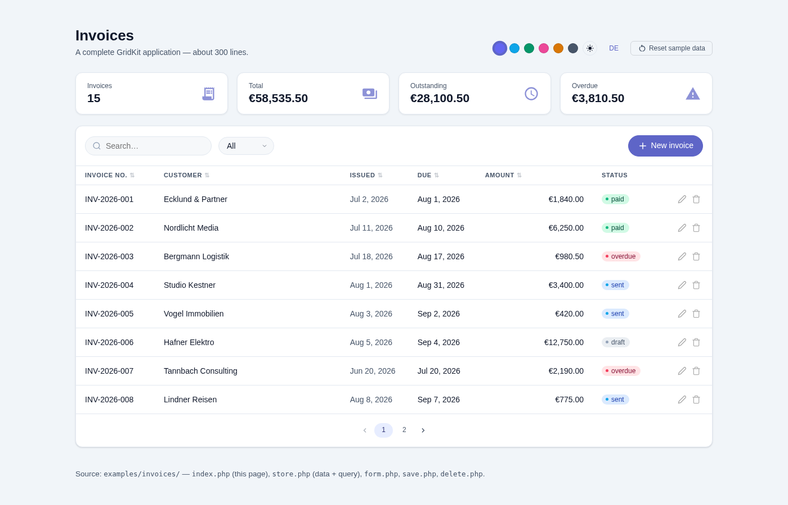

# Examples

Component galleries show what exists. These show what it is for.

Each example is a working application, not a snippet — you can click through it,
break it, and read every line that makes it work.

---

## [`invoices/`](invoices/) — a complete CRUD application



List, create, edit, delete. Search, filter, sort and paging, all answered by the
server over AJAX. Runs in English and German. About 300 lines across five files,
with no database and no build step.

```bash
git clone https://github.com/mmollay/gridkit.git
cd gridkit
php -S localhost:8000
```

Then open <http://localhost:8000/examples/invoices/>.

Data lives in your session, so it is yours alone and disappears when the session
does. **Reset sample data** puts it back.

### What each file is for

| File | Role |
|---|---|
| `index.php` | The page: stat cards, the table, and the AJAX branch |
| `store.php` | The data, and the query that answers what the table asks for |
| `form.php` | The invoice form, loaded into a modal |
| `save.php` | Create and update, answering with JSON |
| `delete.php` | The confirmation dialog and the deletion behind it |

### The three things worth reading

**`store.php` → `queryInvoices()`.** GridKit renders the search box, the filter
dropdown and the sortable headers, and it puts `gk_search`,
`gk_filter_<column>`, `gk_sort` / `gk_dir` and `gk_page` into the URL. It does
not touch your data. Reading those parameters is the application's job — the
function has one block per parameter, each marked with the SQL it stands in for.

**`index.php` → the AJAX branch.** When the browser reloads just the table, the
response is injected straight into the table's wrapper. It must therefore be the
table fragment and nothing else — otherwise the page's own sidebar and scripts
end up inside the table:

```php
if (Table::isAjaxReload('invoices')) {
    $table->render();

    // Anything outside the table that should keep up goes in a template,
    // addressed by a CSS selector. Here: the four cards above it.
    echo '<template data-gk-replace="[data-gk-stats=invoice-stats]">';
    renderStats();
    echo '</template>';

    exit;
}
```

**`index.php` → `rows()`, not `setData()`.** `setData()` hands the whole set to
the browser and lets it search and sort in JavaScript — fine for a hundred rows.
`rows($page, $total)` gives the browser one page and keeps the rest on the
server, which is what you want as soon as the list grows. `query($db, $sql)` is
the third option and does the SQL for you, if your database is MySQL.

### Where it stops

The example is honest about being an example:

- The session is the database. Two browsers see two different sets.
- No authentication. `GridKit\Auth` exists; this example does not use it.
- No CSRF tokens. Add them before anything like this faces the internet.
- Amounts are floats. Real money belongs in integer cents or a decimal column.
